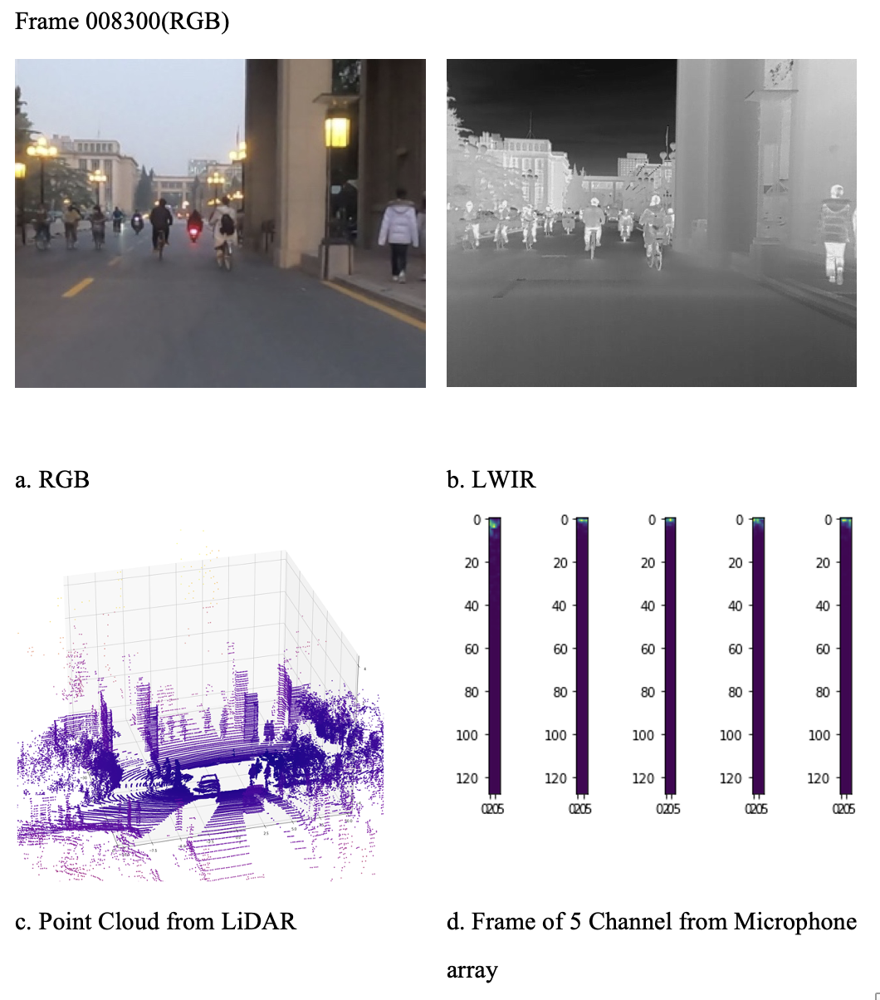
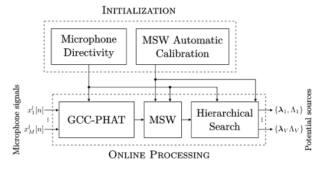
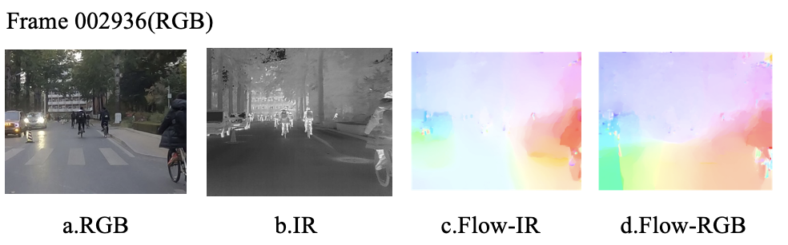
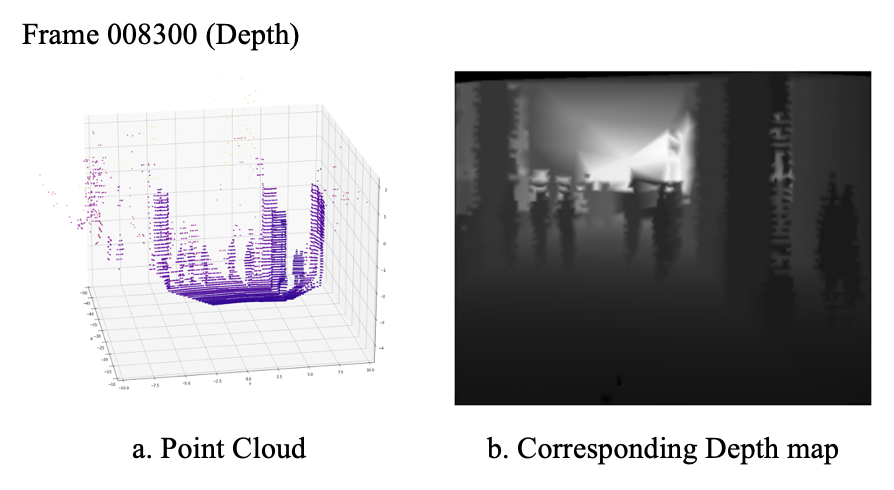
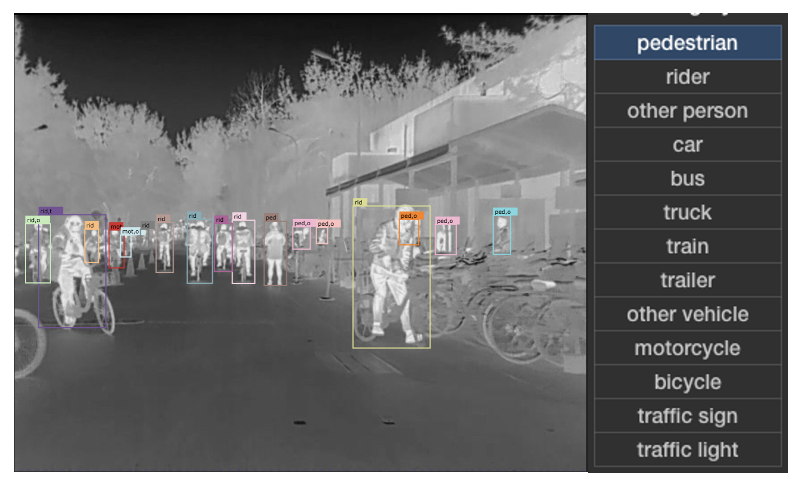
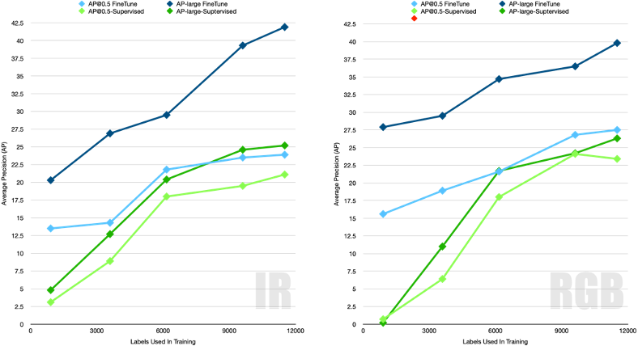

# THU-RMPD
This is a Rich Modality Pedestrian Dataset collected on the campus of Tsinghua University in collaboration with Toyota Research Insitute. 

This dataset contains 11K frames including 17K hand labeled targets in 3K image frames. Overall size is 55GB, with 49GB of temporal aligned and transposed point cloud data, 1.8GB of wav audio file from all 5 channel, 2.4GB of un-trimmed visual image from RGB camera, 451MB of aligned RGB image, 871MB of extracted TV-L1 image, and 167MB of extracted spectrogram files. 

Among 17K labeled targets, there are 5053 labels of pedestrian, 5475 labels of bicycle riders, 2264 labels for cars, 49 labels for bus, 1233 labels for motorcycle, 321 labels for traffic sign, and 477 labels for other vehicles.

To our knowledge, this is the first dataset in the field of AD and ADAS focusing on pedestrian and with modality of both IR,RGB,microphone array and Depth collected with LiDAR. Also we provide off the shelf optical flow map extracted with TV-L1, Extracted MFCC feature of each channel at each frame, and sound source localization and tracking result attained by SRP-PHAT-HSDA algorithm.

All these preprocessed information provides great ground to boot up multi-model fusion and other works. And allowing researchers to quickly establish the feasibility of there proposed methods.

## Sensory Input
In order to lessen data annotation workload and enable the downstream model to construct a much comprehensive understanding of neighboring environment, we collect multiple sensory modalities including Visual RGB signal, Long-wave infrared thermal signal, LiDAR 3D point cloud depth signal, Microphone array 3D audio signal and telemetry signal including GLONASS and BEIDOU position information and kinetic features collected by IMU(Inertial Measuring Units).

(1)	Visual Signal
In our dataset we collected two set of visual signals with different camera from different location, which enable us to evaluate the impact of different camera has toward downstream tasks, also in the field of single camera depth estimation, the height of camera also has fundamental influence on the terminal performance(Currently only one camera data is aligned and released). First camera is mounted on top of car roof which has a FOV of 60 degree emitting 25fps 1920*1080 resolution footage. Second camera is a GoPro Hero 8 mounted on top of engine hood alongside the LWIR camera for more accurate alignment, the camera is set to 25fps on Narrow which has a FOV of 60 degree. The raw camera footage of example frame is shown in Figure 1: Raw sensory input.

(2)	Long-wave Infrared (LWIR) Thermal signal
The most significant signal of pedestrian is their thermal signal, a FLIR VUE PRO 640 camera are set along side the RGB camera on top of the engine hood. The camera are able to detect long-wave(7.5 - 13.5 µm) infrared signal emitted by different heat source with onboard uncooled VOx microbolometer. In our configuration the camera has a FOV of 25°*19°outputting a 9fps 640*512 resolution footage(the framerate is limited to 9fps due to device export control).

(3)	LiDAR 3D Point Cloud Signal
In order to obtain a comprehensive depth information, a Velodyne HDL-64E LiDAR is deployed to collect point cloud data. In our experimental setup the lidar takes 1.9 million 3D points per second with a 26.9°vertical FOV. Each point has a azimuth resolution of 0.08°and about 0.4°vertical resolution with maximum distance of around 120m.

(4)	Microphone Array 3D Audio Signal
The behavior of pedestrian is heavily affected by the sound of the environment, when electric vehicles approach pedestrian, a mass majority of them report to be frighten. Which recently leads to related regulation about EV emitting sounds. In order to capture sound information of a specific spot, we utilized a open-sourced microphone array. The array has 4 digital microphones aligned in a cross, which each has a omnidirectional sensitivity of -26 dBFS, and overloads at 120dBSPL. The SNR of our mics is 63dB. In our experimental setup all 4 channal of single channel input are collected, and another channel with improved voice quality(far field sound enhancement and de-reverberation) processed by the onboard XVF-3000 chip from XMOS is stored as Ch0. 

(5)	Positional Signal and Kinetic Signal
The positional signal is collected with GLONASS+BEIDOU RTK system, for better accuracy only best position result during each 100ms. And also the acceleration information are collected with on board IMU.

### Data Preprocessing

(1)	Sound Source Localization
In our data-preprocessing pipeline, we utilized SRP-PHAT-HSDA method  to do sound source localization(SSL) and sound source tracking(SST). The block architecture are shown in figure. XXX.

The underlying mechanism of SRP-PHAT is to search for V potential sources for each frame over a discrete space [4, 36]. For each potential source, the computed GCC-PHAT frames are filtered using a Maximu (Placeholder1)m Sliding Windows (MSW). The sum of the filtered GCC-PHAT frames for all pairs of microphones provide the acoustic energy for each direction on the discrete space, and the direction with the maximum energy corresponds to a po- tential source. To further reduce SRP-PHAT computations, and main- tain a high localization accuracy regardless of the micro- phone array shape, SRP-PHAT-HSDA adds Microphone Directivity (MD), Maximum Sliding Window Automatic Calibration (MSWAC) and Hierarchical Search(HS) for better performance.
The localization and tracking result are shown in fig.xxx.

(2)	Optical Flow Extraction
In order to obtain motion information between frames and facilitate the representation learning method described in the following sections, we extract TV-L1 optical flow  from both RGB image and IR image. In order to ensure consistency and improve estimation speed, we used TV-L1 CUDA GPU implementation provided by OpenCV 3.4.2. The estimation result are shown below.

(3)	Depth Map Generation
After aligning point cloud information with our camera, we are able to convert our point cloud information into depth image with gridding and interpolation. Related points are projected into camera space and after linear interpolation, the projected point cloud and depth map are shown below.
 

### Data Annotation
In our dataset, 2D Tracking Bounding boxes are annotated in the aligned camera space. Currently, there are all together 10625 frames in our dataset, to reduce labeling cost only part of the dataset is labeled by hand, and each target has a unique used for tracking and a class label chosen from 13 road objects. Our interactive labeling environment allows us to dynamically choose key frame for different target and the environment will automatically carry out interpolation through time to fill in other frames. Among which 2432 frames with at least one target are annotated, which contains 16729 hand annotated bounding boxes. Annotation result and 13 class labels are shown below.

## Baseline

Currently this dataset aims to reduce human labor in data annotation process via multi-modle contrasive learning. The baseline of vanilla Faster-RCNN transfered from image-net and trained from strach on our given datasplit are shown below. Due to crowded scene and lower framerate, the AP result are lower than most other public datasets.

 

